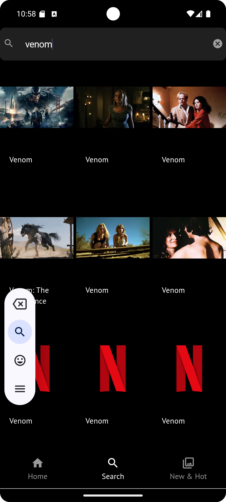
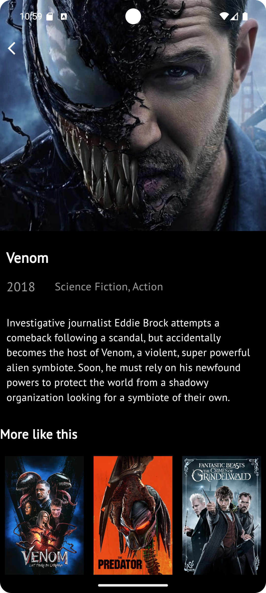
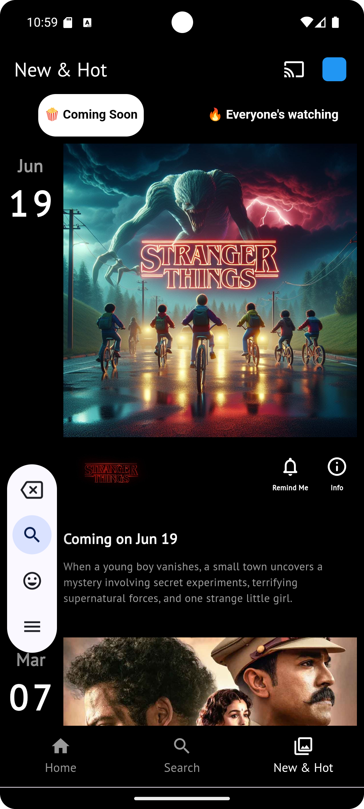

# Netflix App 🎬

A **Flutter** application that allows users to explore movies from various categories (Now Playing, Upcoming, Top Movies) and search for specific movies using the **TMDb API**. This project features a seamless movie search function, no login required.

## Features 🚀

- **Home Screen**:
  - Custom carousel slider showcasing **Top Movies**.
  - Displays **Now Playing** and **Upcoming Movies** sections.
- **Search Functionality**:
  - Displays popular movies by default if no input is provided.
  - As you type, the app fetches and displays movie results dynamically.
- **Movie Details**:
  - Provides detailed information about selected movies, including posters, descriptions, and other key info.
- **Now Playing** and **Upcoming Movies** sections.
- **Top Rated Series** section.

## Getting Started 🔧

### Prerequisites

- **Flutter SDK**: Ensure you have [Flutter](https://flutter.dev/docs/get-started/install) installed.
- **TMDb API Key**: Sign up and get an API key and Authorization token from [TMDb Developer Portal](https://developer.themoviedb.org/).

### Installing

1. **Clone the repository**:

    ```bash
    git clone https://github.com/piro-piyush/Netflix-clone
    cd Netflix-clone
    ```

2. **Install dependencies**:

    ```bash
    flutter pub get
    ```

3. **Setup TMDb API Key**:

   - Get your TMDb API Key and Authorization Token from the TMDb Developer Portal.
   - Create a `.env` file at the root of the project and add your TMDb Authorization Token:

    ```bash
    TMDB_AUTH_TOKEN=your_tmdb_authorization_token
    ```

   Alternatively, you can directly update your token in the API service file.

4. **Run the app**:

    ```bash
    flutter run
    ```

## API Integration 🔑

This app uses the TMDb API to fetch movie data.

### Endpoints Used:
- **Now Playing**: Fetch movies currently playing in theaters.
- **Upcoming Movies**: Get a list of upcoming movies.
- **Search Movies**: Search for movies based on input text.
- **Movie Details**: Retrieve detailed information about individual movies.

### Authorization
Include the Authorization Bearer Token in the headers for API requests:

```dart
final response = await http.get(
  Uri.parse(url),
  headers: {
    'Authorization': 'Bearer YOUR_AUTH_TOKEN',
  },
);
```

## Project Structure 📂

```plaintext
├── lib
│   ├── common
│   │   └── utils.dart 
│   ├── models
│   │   ├── movie_detail_model.dart
│   │   ├── movie_recommendation_model.dart
│   │   ├── now_playing_model.dart
│   │   ├── recommendation_model.dart
│   │   ├── search_movie_model.dart
│   │   ├── top_rated_series_model.dart
│   │   └── upcoming_movie_model.dart
│   ├── screens
│   │   ├── home_screen.dart           // Home screen with carousel and movie sections
│   │   ├── more_screen.dart
│   │   ├── movie_details_screen.dart
│   │   ├── search_screen.dart
│   │   └── splash_screen.dart
│   ├── services
│   │   └── api_services.dart          // API calls to TMDb
│   ├── widgets
│   │   ├── bottom_nav_bar.dart
│   │   ├── coming_soon_movie_widget.dart
│   │   ├── custom_carousel.dart       // Custom carousel for top movies
│   │   ├── now_playing_widget.dart
│   │   └── upcoming_movie_card_widget.dart
│   └── main.dart                      // Main entry point
├── assets
│   ├── images
│   │   └── netflix.png                // Default placeholder image
├── pubspec.yaml                       // Dependencies and assets
└── README.md                          // You are here
```

## Screenshots 📸
<p align="center">
    <strong>Home Screen</strong><br>
    
    <br><br>
    <strong>Search Screen</strong><br>
    
    <br><br>
    <strong>Details Screen</strong><br>
    <br><br>
    <strong>New & Hot</strong><br>
    <br><br>
    <strong>App Demo</strong><br>
    <video src="demo/recording.webm" width="320" height="240" controls></video>
</p>

## Dependencies 🛠️

- **http**: For making API requests.
- **carousel_slider**: For creating the custom carousel on the home screen.
- **flutter_dotenv**: To manage environment variables for storing API tokens.

Install dependencies with:

```bash
flutter pub get
```

## How It Works ⚙️

- **Home Screen**: Displays top movies in a custom carousel slider and includes Now Playing and Upcoming Movies in horizontal scrolling lists.
- **Search**: 
  - Displays popular movies by default.
  - Fetches results dynamically based on typed input.
- **Movie Details**:
  - Shows detailed information about selected movies, including posters, descriptions, and more.

## Getting the API Key 🔑

1. Sign up on [TMDb](https://www.themoviedb.org/).
2. Go to your account settings, navigate to the API section, and generate your API Key and Authorization Bearer Token.
3. Use this token in your requests to access movie data.

## Contribution 🛠️

Feel free to contribute! Open issues, send PRs, or star the repository ⭐

## License 📄

This project is licensed under the MIT License - see the [LICENSE](LICENSE) file for details.

---

Happy Coding! 🎉
