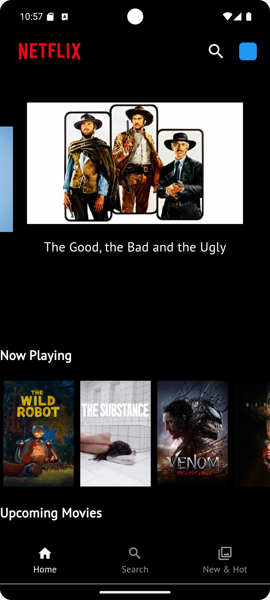
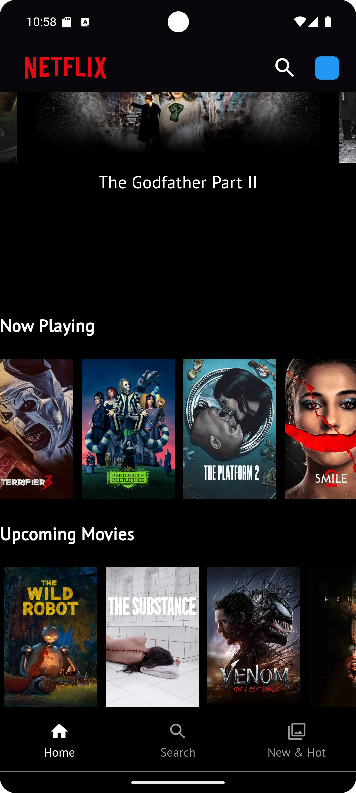
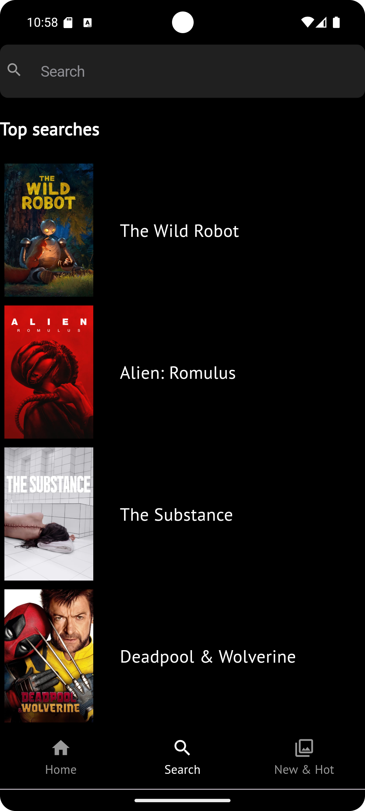

# Movie Search App 🎬

A **Flutter** application that allows users to explore movies from different categories (Now Playing, Upcoming, Top Movies) and search for specific movies using the **TMDb API**. This project showcases a smooth movie search feature with no login required.

## Features 🚀
- **Home Screen**:
  - Custom Carousel Slider showcasing **Top Movies**.
  - Display of **Now Playing** and **Upcoming Movies**.
- **Search Functionality**:
  - If no input is provided, popular movies are displayed.
  - As you type, the app fetches and displays movie results dynamically based on your input.
- **Movie Details**:
  - Get detailed information about any movie, including its poster, description, and other key information.
  
## Getting Started 🔧

### Prerequisites
- **Flutter SDK**: Ensure you have [Flutter](https://flutter.dev/docs/get-started/install) installed.
- **TMDb API Key**: Sign up and get an API key and Authorization token from [TMDb Developer Portal](https://developer.themoviedb.org/).

### Installing

1. **Clone the repository**:

```bash
git clone https://github.com/piro-piyush/Netflix-clone
cd movie-search-app
```

Install dependencies:
```bash
flutter pub get
```

## Setup TMDb API Key:
  Get your TMDb API Key and Authorization Token from TMDb Developer Portal.
  Create a .env file at the root of the project and add your TMDb Authorization Token like this:
  env
  ```bash
  TMDB_AUTH_TOKEN=your_tmdb_authorization_token
  ```
  Alternatively, you can directly update your token in the API service file if you prefer hardcoding it.

## Run the app:
  ```bash
  flutter run
  ```

## API Integration 🔑
This app uses the TMDb API to fetch movie data.

### Endpoints Used:
#### Now Playing: Fetch movies that are currently playing in theaters.
#### Upcoming Movies: Get a list of upcoming movies.
#### Search Movies: Search for specific movies based on the input text.
#### Movie Details: Get more detailed information about individual movies.

###Authorization
Make sure to include the Authorization Bearer Token in the headers for API requests:

  ```dart
  final response = await http.get(
    Uri.parse(url),
    headers: {
      'Authorization': 'Bearer YOUR_AUTH_TOKEN',
    },
  );

Project Structure 📂
```bash
├── lib
|   ├── common
|   |   └── utils.dart 
│   ├── models
|   |   ├── movie_detail_model.dart
|   |   ├── movue_recommendation_model.dart
|   |   ├── now_playing_model.dart
|   |   ├── recommendation_model.dart
|   |   ├── search_movie_model.dart
|   |   ├── top_rated_series_model.dart
│   │   └── upcoming_movie_model.dart
|   ├── screens
│   │   ├── home_screen.dart
│   │   ├── more_screen.dart
│   │   ├── movie_details_screen.dart
│   │   ├── search_screen.dart          // Home screen with carousel and movie sections
│   │   └── splash_screen.dart  // Model for Movie data
│   ├── services
│   │   └── api_services.dart     
│   ├── widgets
│   │   ├── bottom_nav_bar.dart
│   │   ├── coming_soon_movie_widget.dart
│   │   ├── custom_carousel.dart 
│   │   ├── now_playing_widget.dart
│   │   └── upcoming_movie_card_widget.dart 
│   └── main.dart                   // Main entry point
├── assets
│   ├── images
│   │   └── netflix.png             // Default placeholder image
├── pubspec.yaml                    // Dependencies and assets
└── README.md                       // You are here
```

Screenshots 📸
<p align="center"> 
    </p>
  
Dependencies 🛠️
http: For making API requests.
carousel_slider: For creating the custom carousel on the home screen.
flutter_dotenv: To manage environment variables for storing API tokens.
Install dependencies with:
```bash
flutter pub get
```

How It Works ⚙️
Home Screen:

Displays Top Movies in a custom carousel slider.
Shows Now Playing and Upcoming Movies in separate horizontal scrolling lists.
Search:

If you don't type anything, it displays Popular Movies.
When you start typing, the app fetches results dynamically and displays matching movies.
Movie Details:

Tap on any movie to see detailed information like the poster, overview, and more.
Getting the API Key 🔑
Sign up on TMDb.
Go to your account settings and navigate to the API section.
Generate your API Key and Authorization Bearer Token.
Use this token in your requests to access movie data.
Contribution 🛠️
Feel free to contribute! Open issues, send PRs, or even just star the repository 😃

License 📄
This project is licensed under the MIT License - see the LICENSE file for details.

Happy Coding! 🎉

This README provides clear steps for getting started, highlights features, and includes essential project structure and API integration details.
